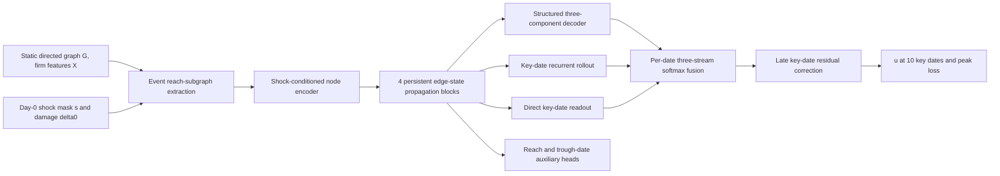

# Architecture and tensor flow

This document describes the model built by:

```python
from mecasnet import Config, build_mecasnet

cfg = Config()
model = build_mecasnet(cfg, feature_count=Fv, profile="paper")
```

Internal class names record the development history. For new experiments,
`build_mecasnet` is the supported entry point and `paper` is the manuscript
profile.

## End-to-end view



The three prediction streams share the encoded graph state but have different
inductive biases. The structured stream constrains trajectory shape, the
recurrent stream propagates state between nonuniform dates, and the direct
stream can represent date-specific departures from both.

## 1. Event-local input graph

For each event, `CascadeEventDataset` starts from directly shocked nodes and
follows supplier-to-customer edges for `reach_hops=5`. The resulting node set is
`reach_idx` with size `Nr`. Only edges with both endpoints in this set are sent
to the model.

The local edge convention is:

```text
edge_src[e]  --supplies-->  edge_dst[e]
```

Two edge weights are derived from the same baseline flow `A[e]`:

```text
edge_a[e]        = A[e] / P_ini[edge_dst[e]]   # customer input share
edge_outshare[e] = A[e] / P_ini[edge_src[e]]   # supplier output share
```

The paper profile uses `edge_a` in message passing. `edge_outshare` is retained
for compatibility with an explicit legacy Day-0 demand-pullback option, which
is disabled in the paper profile.

## 2. Node inputs and information boundary

The encoder receives, for every local node:

```text
[x_v, shock_mask, delta0, event_scalars]
```

`x_v` contains pre-disruption information only:

- sector one-hot encoding when `use_sector_oh=True`;
- standardized `log(1 + in_degree)`;
- standardized `log(1 + out_degree)`;
- standardized `log(1 + P_ini)`;
- standardized log reverse-PageRank;
- membership in the largest strongly connected component.

The event-scalar tensor keeps a width of 12 for checkpoint compatibility. Under
`profile="paper"`, all entries are zero except index 2, which is the mean
observed `delta0` among directly shocked nodes. Recovery times, sampling mode,
severity tier, future states, trajectory targets, reach labels, and trough dates
are not encoder inputs.

With the default hop encoding disabled, the encoder input width is `Fv + 14`:
`Fv` static features, one shock indicator, one node damage value, and 12 event
slots. A two-layer GELU/LayerNorm MLP maps this vector to `h_v in R^64`.

## 3. Deterministic Day-0 boundary

The first predicted production ratio is not learned:

```text
u_v(0) = clip(1 - s_v * delta0_v, 0, 1)
```

This ensures direct physical consistency at the observed boundary. Every
prediction stream is replaced by this value at index 0, so fusion and residual
correction cannot alter Day 0.

## 4. Persistent edge-state propagation

The paper profile applies four `EdgeStateGATBlock` layers. An edge state
`e_ij in R^d` is initialized in the first layer and persists through the
remaining layers of the same event forward pass:

```text
e_ij^(l) = LayerNorm(
    e_ij^(l-1) + MLP([e_ij^(l-1), h_i^(l), h_j^(l), log a_ij])
)
```

The first layer uses an all-zero previous edge state and omits the residual
term. The updated edge state drives both directional messages:

```text
alpha_ij = softmax over suppliers i of customer j (score(e_ij))
msg_supply_j = sum_i alpha_ij * e_ij
msg_demand_i = sum_j e_ij
h_v <- LayerNorm(h_v + msg_supply_v + msg_demand_v)
```

The first aggregation follows material flow from supplier to customer. The
second sends downstream demand information back to suppliers. The edge cache is
created at the start of one forward call and cleared at the end; it never leaks
between events.

## 5. Structured trajectory stream

The structured head predicts three parameter sets per node:

```text
(P1, mu1, sigma1, Tr1), (P2, mu2, sigma2, Tr2),
(P3, mu3, sigma3, Tr3), and u_ss
```

The trough-location and width ranges are partitioned:

| Component | `mu` range, days | `sigma` range, days | Intended role |
|---|---:|---:|---|
| 1 | `[0, 40]` | `[2, 20]` | early decline/trough |
| 2 | `[20, 90]` | `[3, 35]` | intermediate cascade |
| 3 | `[100, 220]` | `[15, 60]` | late trough or secondary wave |

For component `i`, let `d=t-mu_i`. The decline side is a super-Gaussian:

```text
C_i(t) = exp(-0.5 * (|d| / sigma_i)^c),  d <= 0
u_i(t) = 1 - P_i * C_i(t)
```

The paper profile fixes `c=6`. The recovery remaining-gap fraction is:

```text
z = max(d, 0) / Tr_i
R_i(t) = exp(-(max(z, 1e-4))^q_v)
u_i(t) = u_ss + (1 - P_i - u_ss) * R_i(t),  d > 0
```

`q_v` is learned per node and bounded to `[0.5, 2.0]`. The three curves are
combined using a lower envelope with fixed temperature `tau=0.02`:

```text
u_struct(t) = -tau * logsumexp_i(-u_i(t) / tau)
```

The result is clamped to `[0,1]`. A small temperature keeps the Leontief-like
bottleneck interpretation while distributing gradients near component seams.

## 6. Recurrent rollout stream

The rollout starts at the same deterministic `u(0)` and advances over the
nonuniform intervals between key dates. Each step combines directed spatial
messages with a GRU update conditioned on:

```text
[supply message, demand message, current u, shock, delta0, normalized delta-t]
```

The interval is normalized by `DT_NORM=50`. The recurrent path therefore sees
the actual gaps `5, 5, 10, 10, 20, 20, 30, 50, 49` rather than treating the
ten observations as equally spaced.

## 7. Direct key-date stream and fusion

The direct stream maps the post-encoder node state to `K=10` logits and applies
a sigmoid. Fusion has trainable logits of shape `(K,3)`:

```text
w_k = softmax(blend_logits[k])
u_fused[k] = w_k0*u_struct[k] + w_k1*u_rollout[k] + w_k2*u_direct[k]
```

Initial logits are `[2,0,0]`, giving approximate initial weights
`[0.79,0.11,0.11]`. The structured path therefore dominates at initialization,
while optimization can redistribute weight separately at each date.

The inherited late-residual head then predicts a zero-initialized correction.
Its fixed date gates are:

```text
[0.00, 0.00, 0.40, 0.65, 0.90, 0.95, 0.97, 0.98, 0.99, 0.99]
```

This correction cannot change Days 0 or 5 and starts as an exact no-op.

## 8. Primary and auxiliary outputs

The main outputs are:

| Output key | Shape | Meaning |
|---|---:|---|
| `u_keyframes` | `(K,Nr)` | Final production-ratio prediction |
| `peak` | `(Nr,)` | `1 - min_k u_keyframes[k]`, with the observed direct-shock floor enforced |
| `reach_logit` | `(Nr,)` | Auxiliary affected/reach classifier |
| `trough_day_logit` | `(Nr,K)` | Auxiliary trough-key-date classifier |
| `u_ss_learned` | `(Nr,)` | Learned structured steady-state parameter |
| `tau_u_learned` | `(Nr,)` | Diagnostic recovery-rate parameter used by regularization |
| `c_learned` | `(Nr,)` | Diagnostic consumption/capacity parameter |
| `h_final` | `(Nr,d)` | Final latent node representation |

`u_full` is currently an alias of `u_keyframes`; it is not a daily trajectory.
Do not interpret it as 200 simulated daily values.

## 9. Named profiles

| Setting | `paper` | `legacy-y8` |
|---|---:|---:|
| Event scalars | minimal Day-0 descriptor | minimal Day-0 descriptor |
| Day-0 demand pullback | off | off |
| Decline exponent `c` | 6 | 2 |
| Learned recovery exponent `q_v` | on, `[0.5,2.0]` | off |
| Propagation blocks | 4 | 4 when built by the factory |
| Three-stream fusion | on | on when built by the factory |

`legacy-y8` exists to load archived checkpoints. It must not be used to label a
new result as the final manuscript architecture.

## 10. Source map

| Responsibility | Source symbol |
|---|---|
| Static and event preprocessing | `mecasnet.data.StaticNetwork`, `CascadeEventDataset` |
| Node encoder and temporal step | `NodeEncoderV3`, `KSGATStep` in `model_v3.py` |
| Persistent edge states | `EdgeStateCache`, `EdgeStateGATBlock` in `model_v3_decoder_ac.py` |
| Structured curves | `_reconstruct_trajectory`, `_reconstruct_trajectory_trimodal` |
| Three-stream fusion | `KSGATv3.forward` |
| Late residual correction | `KSGATv3Residual.forward` |
| Public profile factory | `mecasnet.factory.apply_profile`, `build_mecasnet` |
